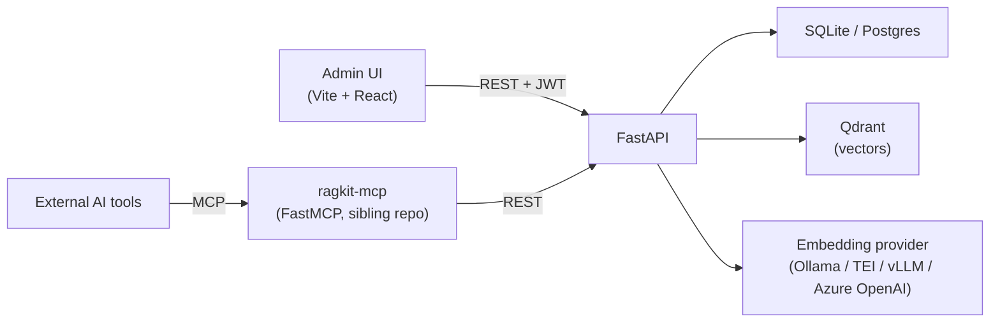

# ragkit

A document-centric RAG platform built with a LangChain LCEL search pipeline, a FastAPI REST server, a FastMCP adapter, and a React admin UI.

> Korean version: [README.md](README.md) | User guide: [docs/user-guide.en.md](docs/user-guide.en.md)

## Architecture



| Path       | Contents                                                |
| ---------- | ------------------------------------------------------- |
| `server/`  | FastAPI REST API, ingestion, embeddings, Qdrant, LCEL   |
| `admin/`   | Vite + React + TypeScript admin SPA (login, documents, search) |

The FastMCP adapter lives in a **separate repository** (`ragkit-mcp`). Clone it next to this repo so MCP and the REST server can be versioned and deployed independently.

## Requirements

- Python 3.11+ and [uv](https://docs.astral.sh/uv/)
- Node.js 20+ and npm
- Docker (for Qdrant; optionally Postgres)
- [Ollama](https://ollama.com) running locally if you use the default embedding provider — pull the model once:
  ```bash
  ollama pull nomic-embed-text
  ```

## Quickstart

```bash
# 1. Start infra (Qdrant + Postgres)
docker compose up -d

# 2. Secrets
cp .env.example .env
# Edit .env: set JWT_SECRET_KEY, INITIAL_ADMIN_PASSWORD, etc.

# 3. Server
cd server
uv sync
uv run uvicorn app.main:app --reload --port 8000

# 4. MCP adapter (separate shell — sibling repo ragkit-mcp)
cd ../ragkit-mcp
uv sync
export MCP_SERVICE_TOKEN=... RAGKIT_API_BASE=http://localhost:8000
uv run python server.py

# 5. Admin UI (separate shell)
cd admin
npm install
npm run dev
```

Open the admin UI at http://localhost:5173.

On first startup the server bootstraps one user using `admin_bootstrap.email` from `server/config.yaml` (default `admin@example.com`) and the `INITIAL_ADMIN_PASSWORD` environment variable. Add more accounts by inserting directly into the DB if needed.

## Configuration

Non-secret configuration lives in `server/config.yaml`:

- `server.upload_dir` — where uploaded files are stored (relative to `server/`)
- `db.url` — SQLite by default; overridden by `DATABASE_URL`
- `vectorstore` — Qdrant URL, collection name, vector size, distance function
- `embeddings.provider` — one of `ollama` (default), `tei`, `vllm`, `azure_openai`
- `ingest.chunk_size` / `chunk_overlap` — text splitter parameters
- `search.default_top_k` / `max_top_k`
- `jwt.algorithm` / `access_token_ttl_minutes`
- `admin_bootstrap.email` / `password_env`

Environment variables (`.env`):

| Variable                  | Purpose                                                  |
| ------------------------- | -------------------------------------------------------- |
| `JWT_SECRET_KEY`          | Signs access tokens (required)                           |
| `DATABASE_URL`            | Overrides `db.url`                                       |
| `VECTORSTORE_API_KEY`     | Sent to Qdrant if the instance requires auth             |
| `EMBEDDING_API_KEY`       | Sent to the embedding provider (TEI / vLLM / Azure OpenAI) |
| `INITIAL_ADMIN_PASSWORD`  | Bootstraps the first admin user                          |
| `MCP_SERVICE_TOKEN`       | Shared token for the MCP adapter to call the REST server |

## MCP Tools

- `search_chunks(query, top_k?, document_id?)`
- `get_document(document_id)`
- `list_documents(limit?, offset?, q?)`

When `MCP_SERVICE_TOKEN` is set the adapter authenticates via `X-Service-Token`. The REST API also accepts a standard `Authorization: Bearer <JWT>` from `/auth/login`.

## Data Flow and Integrity

Each **document** has one stored file and a `status` (`pending` / `chunking` / `embedding` / `indexed` / `failed`).

- **Upload**: save file → chunk → embed → Qdrant upsert → `status=indexed`. On failure, any inserted vectors and the uploaded file are cleaned up and a 500 is returned.
- **Replace**: clear existing vectors and file, then re-run the upload flow.
- **Delete**: Qdrant vectors → DB row (chunks cascade) → upload folder.
- **Search**: LangChain LCEL — `query → embed → Qdrant → enrich` with an optional `document_id` filter in the request body.
