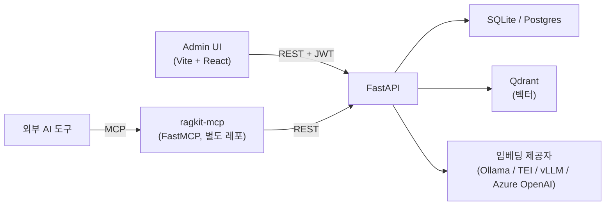

# ragkit

문서 중심의 RAG 플랫폼입니다. LangChain LCEL 검색 파이프라인, FastAPI REST 서버, FastMCP 어댑터, React 관리자 UI로 구성됩니다.

> 사용자 가이드: [docs/user-guide.ko.md](docs/user-guide.ko.md)

## 아키텍처



| 경로       | 내용                                                     |
| ---------- | -------------------------------------------------------- |
| `server/`  | FastAPI REST API, 문서 인제스트, 임베딩, Qdrant, LCEL    |
| `admin/`   | Vite + React + TypeScript 관리자 SPA (로그인, 문서, 검색, 멤버·서비스 관리) |

FastMCP 어댑터는 **별도 레포**(`ragkit-mcp`)에 있습니다. MCP와 REST 서버를 독립적으로 버전 관리·배포할 수 있도록 같은 상위 디렉토리에 나란히 클론하세요.

## 요구사항

- Python 3.11+ 및 [uv](https://docs.astral.sh/uv/)
- Node.js 20+ 및 npm
- Docker (Qdrant 실행용; 선택적으로 Postgres)
- 기본 임베딩 제공자로 [Ollama](https://ollama.com)를 사용하는 경우 로컬에서 실행 후 모델을 받아야 합니다:
  ```bash
  ollama pull nomic-embed-text
  ```

## 빠른 시작

```bash
# 1. 인프라 실행 (Qdrant + Postgres)
docker compose up -d

# 2. 환경변수 설정
cp .env.example .env
# .env 편집: JWT_SECRET_KEY, INITIAL_ADMIN_PASSWORD 등 설정

# 3. 서버 실행
cd server
uv sync
uv run uvicorn app.main:app --reload --port 8000

# 4. MCP 어댑터 실행 (별도 셸 — 형제 레포 ragkit-mcp)
cd ../ragkit-mcp
uv sync
export MCP_SERVICE_TOKEN=... RAGKIT_API_BASE=http://localhost:8000
uv run python server.py

# 5. 관리자 UI 실행 (별도 셸)
cd admin
npm install
npm run dev
```

관리자 UI는 http://localhost:5173 에서 접근할 수 있습니다.

서버 최초 기동 시 `server/config.yaml`의 `admin_bootstrap.email`(기본값 `admin@example.com`)과 `INITIAL_ADMIN_PASSWORD` 환경변수로 첫 번째 superadmin 계정과 Default 서비스를 자동 생성합니다. 추가 서비스는 관리자 UI의 Services 페이지에서, 추가 계정은 DB에 직접 삽입 후 Members 페이지에서 서비스에 초대하세요.

## 설정

비밀이 아닌 설정은 `server/config.yaml`에서 관리합니다:

- `server.upload_dir` — 업로드 파일 저장 경로 (`server/` 기준 상대 경로)
- `db.url` — 기본값 SQLite; `DATABASE_URL` 환경변수로 덮어씀
- `vectorstore` — Qdrant URL, 컬렉션명, 벡터 차원, 거리 함수
- `embeddings.provider` — `ollama`(기본), `tei`, `vllm`, `azure_openai` 중 선택
- `ingest.chunk_size` / `chunk_overlap` — 텍스트 분할 파라미터
- `search.default_top_k` / `max_top_k`
- `jwt.algorithm` / `access_token_ttl_minutes`
- `admin_bootstrap.email` / `password_env`

환경변수 (`.env`):

| 변수                      | 용도                                                      |
| ------------------------- | --------------------------------------------------------- |
| `JWT_SECRET_KEY`          | 액세스 토큰 서명 (필수)                                   |
| `DATABASE_URL`            | `db.url` 덮어씀                                           |
| `VECTORSTORE_API_KEY`     | Qdrant 인증이 필요한 경우 전송                            |
| `EMBEDDING_API_KEY`       | 임베딩 제공자 인증 (TEI / vLLM / Azure OpenAI)            |
| `INITIAL_ADMIN_PASSWORD`  | 첫 번째 관리자 계정 비밀번호                              |
| `MCP_SERVICE_TOKEN`       | MCP 어댑터가 REST 서버를 호출할 때 사용하는 공유 토큰     |

## MCP 도구

- `search_chunks(query, top_k?, document_id?)`
- `get_document(document_id)`
- `list_documents(limit?, offset?, q?)`

`MCP_SERVICE_TOKEN`이 설정된 경우 어댑터는 `X-Service-Token` 헤더로 인증합니다. REST API는 `/auth/login`에서 발급한 일반 `Authorization: Bearer <JWT>`도 허용합니다.

## 데이터 흐름 및 무결성

각 **문서**는 파일 하나와 `status`(`pending` / `chunking` / `embedding` / `indexed` / `failed`)를 가집니다.

- **업로드**: 파일 저장 → 청킹 → 임베딩 → Qdrant upsert → `status=indexed`. 실패 시 삽입된 벡터를 삭제하고 파일도 정리한 뒤 500을 반환합니다.
- **교체**: 기존 벡터·파일 삭제 후 업로드와 동일한 흐름으로 재인덱싱합니다.
- **삭제**: Qdrant 벡터 → DB 행(청크 cascade) → 업로드 폴더 순으로 삭제합니다.
- **검색**: LangChain LCEL — `쿼리 → 임베딩 → Qdrant → 결과 보강`. 요청 body에 `document_id` 필터를 포함할 수 있습니다.
